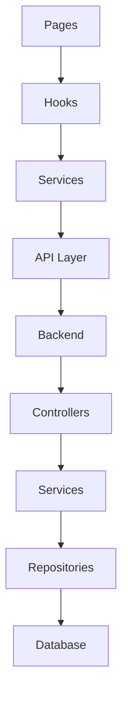

# AI_RULES.md
> Bộ quy tắc AI coding chung — tương thích Cursor, Claude Code, Windsurf, Copilot, Aider, Roo Code.
> AI agent PHẢI đọc file này trước khi sinh code.

---

## ⚡ VIBE CODING — QUY TẮC ƯU TIÊN CAO NHẤT

> Vibe coding = phát triển nhanh, AI-first, lặp liên tục. Mục tiêu là **tốc độ + chất lượng**, không phải hoàn hảo ngay từ đầu.

### AI PHẢI:
- **Hành động ngay** — không hỏi lại khi đã đủ context, không xin phép khi task rõ ràng
- **Sinh code chạy được ngay** — ưu tiên working code hơn perfect code
- **Đề xuất cấu trúc trước** khi viết code cho task lớn (1–2 dòng plan, không dài dòng)
- **Tự hoàn thành** — nếu thiếu thông tin nhỏ, tự đưa ra assumption hợp lý và ghi chú lại
- **Tập trung vào yêu cầu cốt lõi** — bỏ qua edge case không được đề cập
- **Ghi comment TODO** thay vì block coding khi gặp phần chưa chắc
- **Lặp nhanh** — sinh bản đầu → nhận feedback → sửa, không cố gắng hoàn hảo lần đầu
- **Giữ diff nhỏ** — mỗi thay đổi chỉ làm một việc, dễ review và rollback

### AI KHÔNG ĐƯỢC:
- Hỏi nhiều câu hỏi trước khi bắt đầu (tối đa 1 câu nếu thực sự cần)
- Giải thích dài dòng trước khi viết code
- Tạo abstraction khi chưa có yêu cầu cụ thể (YAGNI)
- Refactor code không liên quan đến task hiện tại
- Sinh boilerplate thừa (test file, README...) khi không được yêu cầu

### Luồng vibe coding lý tưởng:
```
Nhận yêu cầu → Hiểu intent → Sinh code → Ghi chú assumption → Done
```

---

## 1. TỔNG QUAN DỰ ÁN

### Loại dự án
Fullstack Web Application

### Stack chính
- React / Vite / Next.js
- TypeScript
- TailwindCSS
- Node.js / .NET / Express
- REST API
- Zustand / Redux
- Axios

---

## 2. KIẾN TRÚC TỔNG QUAN

```
Frontend
 ├── Pages          (điều phối layout)
 ├── Components     (UI thuần túy)
 ├── Hooks          (logic tái sử dụng)
 ├── Services       (business logic)
 ├── Store          (global state)
 └── API Layer      (giao tiếp backend)

Backend
 ├── Controllers    (nhận request)
 ├── Services       (xử lý nghiệp vụ)
 ├── Repositories   (truy xuất dữ liệu)
 ├── Database
 └── Middleware
```

### Luồng dữ liệu chuẩn
```
Page → Hook → Service → API → Backend
```

---

## 3. CẤU TRÚC THƯ MỤC

```
src/
├── api/            # API layer (client, endpoints)
├── assets/         # Static assets
├── components/
│   ├── ui/         # UI thuần, không có business logic
│   └── common/     # Component dùng chung có context nghiệp vụ
├── pages/          # Route pages
├── layouts/        # Layout wrappers
├── hooks/          # Custom hooks
├── services/       # Business logic
├── store/          # Global state
├── utils/          # Helper functions
├── constants/      # Hằng số / enums
├── types/          # Global TypeScript types
├── routes/         # Route config
├── styles/         # Global styles
└── lib/            # Internal libraries
```

---

## 4. QUY TẮC CHUNG CHO AI

### AI PHẢI:
- Giữ nhất quán kiến trúc hiện tại
- Kiểm tra pattern đang dùng trước khi viết code mới
- Tái sử dụng utils / components / hooks sẵn có
- Tránh logic trùng lặp
- Giữ nhất quán cách đặt tên
- Sinh code production-ready
- Ưu tiên maintainability hơn clever code

### AI KHÔNG ĐƯỢC:
- Sửa file không liên quan đến task
- Tạo abstraction không cần thiết
- Thêm dependency không có lý do rõ ràng
- Sinh fake API trừ khi được yêu cầu
- Hardcode secrets / credentials
- Di chuyển file không có lý do
- Sinh component / hook quá lớn (xem giới hạn file)

---

## 5. QUY TẮC COMPONENT

### PHẢI:
- Single responsibility
- Modular, reusable
- Tập trung vào presentation

### KHÔNG ĐƯỢC:
- Gọi API trực tiếp trong component
- Chứa business logic
- Chứa database logic
- Làm transform dữ liệu phức tạp

### Pattern ưu tiên:
```tsx
Page → Hook → Service → API
```

---

## 6. QUY TẮC PAGE

### Page NÊN:
- Chỉ điều phối layout
- Delegate logic xuống hooks / services
- Giữ file mỏng, gọn

### Page KHÔNG NÊN:
- Fetch dữ liệu trực tiếp
- Transform dataset lớn
- Chứa UI logic có thể tái sử dụng

---

## 7. QUY TẮC BUSINESS LOGIC

### Business logic thuộc về:
- `services/`
- `hooks/`
- `store/`

### KHÔNG bao giờ đặt trong:
- Render functions
- UI components
- Layouts

---

## 8. QUY TẮC API

### Tất cả API calls PHẢI:
- Dùng centralized API client
- Xử lý error nhất quán
- Có typed response
- Hỗ trợ cancellation khi cần

### KHÔNG ĐƯỢC:
- Dùng `fetch` thô trong component
- Trùng lặp endpoint
- Hardcode URL

```ts
// ✅ Đúng
userService.getProfile()

// ❌ Sai
axios.get('/api/user')
```

---

## 9. QUY TẮC STATE MANAGEMENT

### Local State — dùng:
- `useState`
- `useReducer`

### Global State — dùng:
- Zustand (ưu tiên)
- Redux
- Context (chỉ khi thực sự cần)

### Nguyên tắc:
- Tránh global state không cần thiết
- Tránh duplicate server state
- Ưu tiên dùng selector
- Tránh nested store quá sâu

---

## 10. QUY TẮC HOOK

### Hook PHẢI:
- Bắt đầu bằng `use`
- Đóng gói logic tái sử dụng
- Không render UI
- Isolate side effect đúng cách

```ts
// ✅ Đúng
useAuth()
useFetchUsers()
```

---

## 11. QUY TẮC TYPESCRIPT

### Ưu tiên:
- Explicit typing
- Interface cho objects
- Utility types khi phù hợp

### Tránh:
- `any`
- Unsafe type assertion
- Implicit unknown structure

```ts
// ✅ Đúng
interface User {
  id: string
  name: string
}
```

---

## 12. QUY TẮC IMPORT

### Thứ tự import:
1. External libraries
2. Internal aliases (`@/`)
3. Relative imports
4. Styles

```ts
import React from 'react'

import { Button } from '@/components/ui/button'
import { useAuth } from '@/hooks/useAuth'

import './styles.css'
```

---

## 13. GIỚI HẠN KÍCH THƯỚC FILE

| Loại file    | Tối đa  |
|--------------|---------|
| Component    | 200 dòng |
| Hook         | 150 dòng |
| Service      | 300 dòng |
| Utility      | 100 dòng |

> Nếu vượt quá → tách thành module nhỏ hơn.

---

## 14. QUY ƯỚC ĐẶT TÊN

| Loại          | Quy ước          | Ví dụ              |
|---------------|------------------|--------------------|
| Component     | PascalCase       | `UserCard.tsx`     |
| Hook          | useCamelCase     | `useAuth.ts`       |
| Utils         | camelCase        | `formatDate.ts`    |
| Constants     | UPPER_SNAKE_CASE | `MAX_RETRY_COUNT`  |
| Interface     | PascalCase       | `UserProfile`      |
| Type          | PascalCase       | `ApiResponse`      |

---

## 15. QUY TẮC STYLING

### Thứ tự ưu tiên:
1. TailwindCSS
2. CSS Modules
3. Styled Components

### Tránh:
- Inline styles
- Magic spacing
- Màu sắc / font không nhất quán

### Spacing scale chuẩn:
`4 — 8 — 12 — 16 — 24 — 32 — 48 — 64`

---

## 16. QUY TẮC UI/UX

### UI PHẢI:
- Responsive trên mọi màn hình
- Tránh layout shift
- Có loading state
- Có empty state
- Hỗ trợ accessibility (a11y)
- Nhất quán về visual

---

## 17. QUY TẮC PERFORMANCE

### Ưu tiên:
- Lazy loading
- Memoization (chỉ khi thực sự cần)
- Pagination
- Virtualization cho danh sách lớn

### Tránh:
- Premature optimization
- Re-render không cần thiết
- Global state quá lớn

---

## 18. QUY TẮC FORM

### Form PHẢI:
- Validate input
- Chặn duplicate submit
- Có loading state
- Có error state

### Thư viện ưu tiên:
- `react-hook-form`
- `zod` (validation schema)

---

## 19. QUY TẮC ERROR HANDLING

### LUÔN LUÔN:
- Handle async error
- Cung cấp log hữu ích
- Cung cấp fallback UI

### KHÔNG BAO GIỜ:
- Nuốt error im lặng
- Dùng empty catch block

```ts
// ✅ Đúng
try {
  await fetchUsers()
} catch (error) {
  console.error('[fetchUsers]', error)
  // Show fallback UI
}
```

---

## 20. QUY TẮC AUTH

### KHÔNG BAO GIỜ:
- Expose secrets
- Hardcode credentials
- Lưu sensitive token không an toàn

### LUÔN LUÔN:
- Validate auth state
- Handle token expiration
- Protect private routes

---

## 21. QUY TẮC ROUTING

### Routes PHẢI:
- Tập trung ở một nơi (route config)
- Hỗ trợ route guards
- Group protected routes logic

---

## 22. QUY TẮC CLEAN CODE

### Tránh:
- Nested condition quá sâu
- Logic trùng lặp
- Hàm quá dài
- Magic numbers

### Ưu tiên:
- Early returns
- Pure functions
- Tên biến / hàm mô tả rõ ý nghĩa

---

## 23. QUY TẮC COMMENT

### Chỉ comment khi:
- Logic phức tạp
- Quyết định kiến trúc quan trọng
- Behavior không hiển nhiên

### Tránh comment thừa:
```ts
// ❌ Sai — quá rõ ràng
i++ // tăng i lên 1

// ✅ Đúng — giải thích WHY, không phải WHAT
// Delay 100ms để tránh race condition với animation
await sleep(100)
```

---

## 24. QUY TẮC REFACTOR

### Chỉ refactor khi:
- Được yêu cầu rõ ràng
- Duplication nghiêm trọng
- Maintainability cải thiện đáng kể

### KHÔNG BAO GIỜ:
- Refactor file không liên quan
- Break public APIs

---

## 25. QUY TẮC DEPENDENCY

### Trước khi thêm dependency, AI PHẢI kiểm tra:
- Dự án đã có thư viện tương tự chưa?
- Có native solution không?
- Bundle size ảnh hưởng thế nào?
- Có tương thích không?

### Tránh:
- UI library không cần thiết
- Utility bị trùng lặp
- Dependency chồng chéo nhau

---

## 26. QUY TẮC TESTING

### Ưu tiên:
- Unit test cho utilities
- Integration test cho flows
- Selector ổn định (không phụ thuộc implementation detail)

### Tránh:
- Test chi tiết implementation (test behavior, không test code)

---

## 27. QUY TẮC GIT COMMIT

### Format:
```
feat:     tính năng mới
fix:      sửa bug
refactor: cải thiện code không thêm feature / sửa bug
style:    format, whitespace
docs:     tài liệu
test:     thêm hoặc sửa test
chore:    task phụ (deps, config...)
```

### Ví dụ:
```
feat(auth): thêm refresh token support
fix(user): sửa lỗi không load avatar khi url rỗng
```

---

## 28. QUY TẮC HIỂU REPO

### AI PHẢI kiểm tra trước khi sinh code:
- Cấu trúc thư mục
- Pattern đang được sử dụng
- Naming convention
- Dependency graph
- Route structure
- API structure

---

## 29. TOOLING GỢI Ý

| Mục đích             | Tool               |
|----------------------|--------------------|
| Dependency graph     | Madge              |
| Repo intelligence    | Sourcegraph        |
| Dependency lint      | dependency-cruiser |
| Function flow        | Code2Flow          |
| Diagram / UML        | Mermaid            |
| AI pair coding       | Aider / Claude Code |

### Scripts hữu ích (package.json):
```json
{
  "scripts": {
    "ai:tree":     "tree src > tree.txt",
    "ai:graph":    "madge --image graph.svg src",
    "ai:circular": "madge --circular src",
    "ai:deps":     "depcruise src --include-only '^src'",
    "ai:map":      "npm run ai:tree && npm run ai:graph"
  }
}
```

---

## 30. KIẾN TRÚC MERMAID



---

## 31. THỨ TỰ ƯU TIÊN KHI SINH CODE

1. Tái sử dụng code hiện có
2. Giữ nguyên kiến trúc
3. Đảm bảo readable
4. Giữ file modular
5. Tránh duplication
6. Tối thiểu hóa dependency
7. Đảm bảo scalable

---

## 32. CHECKLIST TRƯỚC KHI SUBMIT CODE

- [ ] Không có logic trùng lặp
- [ ] Không có import thừa
- [ ] Không còn `console.log` debug
- [ ] Types đúng và đầy đủ
- [ ] Error handling có mặt
- [ ] Loading state được xử lý
- [ ] Kiến trúc hiện tại được giữ nguyên
- [ ] Naming nhất quán
- [ ] Accessibility được giữ
- [ ] UI responsive
- [ ] Không thêm dependency không cần thiết
- [ ] Component / Hook không quá lớn
- [ ] API layer được tôn trọng
- [ ] Business logic được isolate
- [ ] Import được clean

---

## 33. THỨ TỰ THỰC THI KHI GIẢI TASK

```
1.  Phân tích yêu cầu và intent
2.  Kiểm tra cấu trúc và pattern liên quan
3.  Phát hiện pattern đang dùng
4.  Tái sử dụng utils / hooks / components sẵn có
5.  Implement minimal — đủ dùng, không thừa
6.  Validate types
7.  Validate kiến trúc
8.  Tối ưu readability
9.  Kiểm tra edge case cơ bản
10. Final cleanup
```

---

## 34. NGUYÊN TẮC BẤT BIẾN

AI KHÔNG BAO GIỜ ĐƯỢC:
- Sinh fake production logic
- Phá vỡ kiến trúc hiện tại
- Duplicate hook / service / component
- Hardcode secret / credential
- Bypass centralized API layer
- Tạo abstraction không cần thiết
- Sửa file không liên quan
- Bỏ qua convention hiện có
