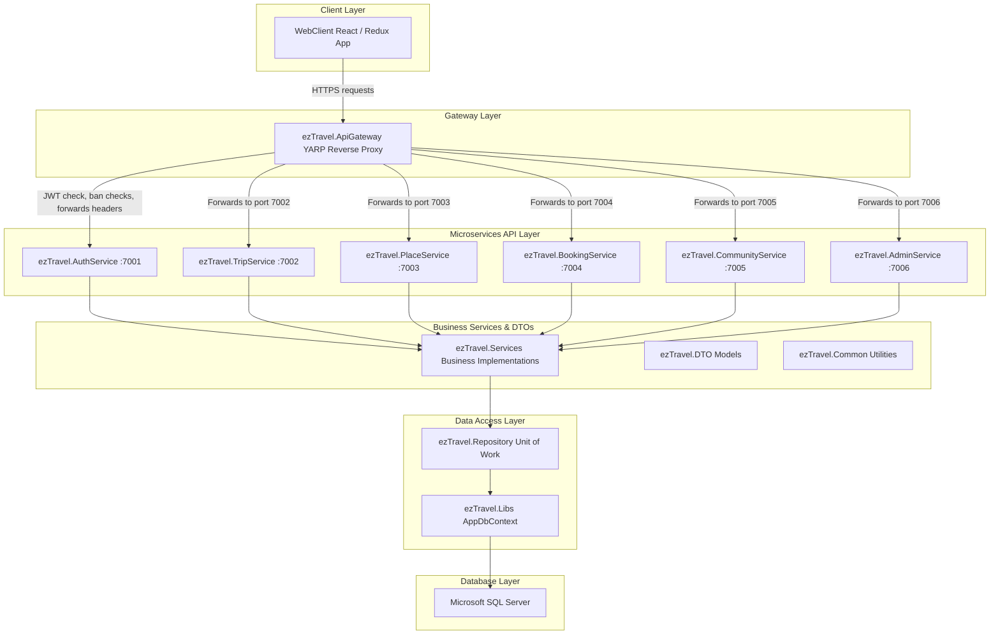

# EZTravel System Architecture

## 1. Executive Summary

EZTravel is a comprehensive self-sufficient travel planning and discovery platform. It is designed to assist travelers in discovering destinations, building highly detailed visual itineraries, finding and aggregating local services (accommodations, dining, activities, and transport), and sharing experiences with a travel community. 

### Purpose of the Platform
To eliminate fragmentation in trip planning by unifying discovery, dynamic itinerary planning, service selection, and community sharing in a single application.

### Target Users
* **Travelers / Planners**: Individuals looking to discover destinations, coordinate daily routes, map out travel budgets, and build custom itineraries.
* **Service Providers**: Local businesses (hotels, restaurants, activity planners, transport operators) seeking to list services, view performance analytics, and manage client reviews.
* **System Administrators**: System operators responsible for verifying providers, moderating community content (reviews, blogs, reports), and managing user access.

### Main Business Domains
1. **Trip Planning (Itinerary Workspace)**: Interactive workspace mapping days, places, services, transport transitions, and budgets.
2. **Explore & Discovery**: Province-based location and service catalogs with reviews and search filters.
3. **Community & Social Interaction**: User blogging, reviews, likes, comments, and follower networks.
4. **Provider Operations**: Service listing, approval pipelines, and booking analytics dashboards.
5. **Content Moderation & Verification**: Administrative queues for reports, content verification, and user management.

---

## 2. Technology Stack

### Frontend
* **Core Framework**: React 19.2.5 (Vite 8.0.10, TypeScript 6.0.3)
* **Routing**: React Router DOM 7.1.5 (configured using `createBrowserRouter` object routing)
* **State Management**: Redux Toolkit 2.12.0 & React Redux 9.3.0
* **API Integration**: Redux Toolkit Query (RTK Query) with Axios-based queries (`axiosBaseQuery`)
* **Styling**: TailwindCSS v4.3.0 (CSS variables config)
* **Drag-and-Drop Engine**: `@dnd-kit/core`, `@dnd-kit/sortable`, `@dnd-kit/utilities`
* **Maps Integration**: `@react-google-maps/api`
* **Charts & Analytics**: `recharts` (Recharts SVG charts)
* **Interactive UI & Dialogs**: Radix UI primitives (Avatar, Dialog, Label, Select, Tabs, Tooltip), SweetAlert2

### Backend
* **Runtime**: .NET 8.0 Core
* **Web Framework**: ASP.NET Core Web API (controllers-based architecture)
* **Database Driver / Spatial Support**: Microsoft.EntityFrameworkCore 8, Microsoft.EntityFrameworkCore.SqlServer, NetTopologySuite (spatial geometry library)
* **API Gateway**: YARP (Yet Another Reverse Proxy)
* **Authentication**: Microsoft.AspNetCore.Authentication.JwtBearer & Microsoft.IdentityModel.Tokens

### Database
* **Database Engine**: Microsoft SQL Server
* **ORM**: Entity Framework Core 8 (Scaffolded DbContext representation)
* **Migration Strategy**: Database-first schema mapping (Full SQL Scaffolding script located at `database/archive/full database EZTravel.sql`).

---

## 3. High Level Architecture

EZTravel utilizes a decoupled microservices architecture coordinated by an API Gateway. All frontend client requests pass through the YARP API Gateway, which handles JWT verification, claims parsing, blocked user verification, and routes requests to the corresponding backend microservices.



---

## 4. Project Structure

The EZTravel workspace contains the following projects:

### 1. DataAccess Layer (`d:\eztravel\DataAccess`)
* **ezTravel.Entities**: Holds EF core entity models mapped from SQL Server tables.
  * *Responsibility*: Define database domain objects.
* **ezTravel.Libs**: Holds EF Core `AppDbContext` configure options, database connection setups, spatial configuration, and migrations history snapshot.
  * *Responsibility*: Database configuration and EF Core schema constraints mapping.
* **ezTravel.Repository**: Generic repository pattern implementation with custom database unit of work wrapper.
  * *Responsibility*: Abstract query logic away from services. Contains repositories (`GenericRepository`) and units of work (`UnitOfWork`).

### 2. Services Layer (`d:\eztravel\Services`)
* **ezTravel.Common**: Core helpers (e.g. `UserContextHelper.cs` to fetch user claims).
  * *Responsibility*: Provide shared validation/extraction functions.
* **ezTravel.DTO**: Shared Data Transfer Objects representing serialized input requests and response models.
  * *Responsibility*: Manage API contracts and request validations.
* **ezTravel.Services**: Heavy-lifting business services (Trip builder services, Place management, Community actions, Admin controls).
  * *Responsibility*: Process business rules, coordinate repositories, and return data to controller layers.

### 3. Microservices API Layer (`d:\eztravel\Microservices`)
* **ezTravel.ApiGateway**: Reverse proxy mapping endpoints, decoding JWT tokens, injecting `X-User-Id` headers, and filtering banned users.
* **ezTravel.AuthService**: Mapped on port 7001. Handles register, login, OTP authentication, and session token creations.
* **ezTravel.TripService**: Mapped on port 7002. Handles trip workspace CRUD, recommendations queries, day reorder operations, and trip cloning.
* **ezTravel.PlaceService**: Mapped on port 7003. Coordinates place catalogs, categories, nearby location lookups, and specialized services (hotels, food, activities).
* **ezTravel.BookingService**: Mapped on port 7004. Manages service providers.
* **ezTravel.CommunityService**: Mapped on port 7005. Manages reviews, blog posts feeds, comments, and likes.
* **ezTravel.AdminService**: Mapped on port 7006. Moderates users, locks/unlocks profiles, aggregates stats.

### 4. Frontend WebClient (`d:\eztravel\WebClient`)
* **src/api**: Base RTK Query configurations and service injections.
* **src/layouts**: Shared router wrappers (Auth, Main, Admin, Provider, AI layout views).
* **src/modules**: Encapsulates specific domain business logic UI components (auth, trip planning, design-system showcase, provider dashboards).
* **src/store**: Redux state slices (auth, trip, explore, provider, admin, ai).
* **src/routes**: React Router DOM index configuration.
* **src/design-system**: Standard component styles showcase.

---

## 5. Business Modules

### Authentication
* **Purpose**: Manage account registration, logins, session verification, and OTP validations.
* **Features**: Password hashing verification, token generation, user verification via OTP, account state validation (BANNED/ACTIVE).
* **Pages**: Login (`/login`), Register (`/register`), OTP Verification (`/verify-otp`), Forgot Password (`/forgot-password`), Reset Password (`/reset-password`).
* **APIs**: `POST api/auth/register`, `POST api/auth/login`, `GET api/auth/me`.
* **Database Tables**: `NGUOI_DUNG` (User), `OTP_XAC_THUC` (OTP tokens), `REFRESH_TOKEN` (Refresh logs).
* **Current Status**: **Implemented** (JWT sessions verify successfully; gate validation blocks banned users).

### Trip Planner
* **Purpose**: Interactive workspace allowing users to build daily routes, drag locations/services, manage budgets, and trace routes.
* **Features**: Drag-and-drop days/timeline rearrangement, nested location canvases (hotel, restaurant, activity allocations), trip duplicate cloning, automatic budget summary adjustments, map markers and polylines integration.
* **Pages**: Trip Workspace (`/planner`), Specific Trip View (`/planner/:id`).
* **Redux Stores**: `tripSlice.ts` manages timeline days state, active trip, selected day, sidebar scratchpads, and budget summaries.
* **Components**: `PlannerSidebar`, `PlannerTimeline`, `PlannerRightPanel` (Budget, Map view tabs), `MapPanel`, `BudgetPanel`.
* **APIs**: `GET api/trips`, `GET api/trips/{id}`, `POST api/trips`, `PUT api/trips/{id}`, `DELETE api/trips/{id}`, `POST api/trips/{id}/locations`, `DELETE api/trips/{id}/items/{itemId}`, `PUT api/trips/{id}/reorder`, `GET api/trips/{id}/cost`, `POST api/trips/{id}/clone`.
* **Database Tables**: `LICH_TRINH` (Trip), `NGAY_LICH_TRINH` (Days), `DIA_DIEM_LICH_TRINH` (Timeline items), `DICH_VU_LICH_TRINH` (Timeline services), `CHI_PHI_DICH_VU_LICH_TRINH` (Itinerary costs), `LICH_SU_CLONE` (Cloning logs), `LUU_LICH_TRINH` (Saved trips), `CHIA_SE_LICH_TRINH` (Trip sharing configurations).
* **Current Status**: **Partially Implemented**. Full Drag-and-Drop state and visual UI are operational. Trip duplicating is implemented. However, database sharing (`CHIA_SE_LICH_TRINH`), clone auditing (`LICH_SU_CLONE`), and saving (`LUU_LICH_TRINH`) tables exist but lack business logic services in the C# layer (they are placeholders in DB).

### Community
* **Purpose**: Provide community feeds, destination/service reviews, and comment threads.
* **Features**: Write place/service reviews with multi-dimensional rating scores, list blog/social feeds, like blog posts, post comments.
* **Pages**: Community feed is embedded in Explore module view layout.
* **APIs**: `POST api/reviews` (Post Review), `GET api/reviews/place/{id}`, `GET api/reviews/service/{id}`, `GET api/feeds` (Feeds List), `POST api/feeds/{tripId}/like` (Toggle Like), `POST api/feeds/{tripId}/comment` (Post Comment), `GET api/feeds/{tripId}/comments` (View Comments).
* **Database Tables**: `DANH_GIA` (Review), `ANH_DANH_GIA` (Review images), `PHAN_HOI_DANH_GIA` (Provider replies), `BAI_VIET` (Blogs), `ANH_BAI_VIET` (Blog images), `BINH_LUAN_BAI_VIET` (Comments), `THICH_BAI_VIET` (Blog likes), `THICH_LICH_TRINH` (Trip likes), `BAO_CAO_NOI_DUNG` (Reports queue).
* **Current Status**: **Partially Implemented**. Reviews and Feeds are fully operational. However, the feed comments and likes are internally mapped to `BAI_VIET` (Blog Posts) and `THICH_BAI_VIET` tables instead of trips directly (the controller handles `tripId` parameter but queries the `BAI_VIET` table underneath). `TheoDoiNguoiDung` (Follower network) database table exists but has no business services mapping.

### Explore
* **Purpose**: Browse and search cities, destinations, and local business services (dining, hotels, transportation).
* **Features**: Keyword search, type filters, nearby location queries (lat/lng radius mapping), province categorization.
* **Pages**: Explore Workspace (`/explore`).
* **APIs**: `GET api/places/search`, `GET api/places/{id}`, `GET api/places/nearby`, `GET api/places/categories` (TinhThanhs list).
* **Database Tables**: `DIA_DIEM` (Locations), `ANH_DIA_DIEM` (Location images), `TINH_THANH` (Provinces), `DICH_VU` (Services), `TAG` (Tags), `DIA_DIEM_TAG` (Join table).
* **Current Status**: **Implemented**. Complete integration with coordinates and spatial data (NetTopologySuite).

### Admin
* **Purpose**: Control user activities, approve service providers, lock/unlock accounts, audit reports, and moderate services.
* **Features**: List users, lock users, retrieve stats dashboard, approve or reject service provider applications.
* **Pages**: Admin Panel (`/admin`), User Manager (`/admin/users`), Places Manager (`/admin/places`), Provider Approval (`/admin/providers`), Service Moderation (`/admin/services`), Blog Moderation (`/admin/blogs`), Reports Queue (`/admin/reports`).
* **APIs**: `GET api/admin/users`, `POST api/admin/users/{id}/lock`, `GET api/admin/dashboard` (Stats), `GET api/admin/bookings`, `GET api/admin/bookings/{id}`, `GET api/admin/payments`, `GET api/admin/payments/{id}`.
* **Database Tables**: `DUYET_NOI_DUNG` (Content verification history).
* **Current Status**: **Partially Implemented**. User management, provider approval, and verification queues are implemented. Admin dashboard stats, bookings, and payments are **mocked placeholders** due to the frozen schema (the C# services return empty lists/0 with comments that booking tables are blocked).

### Provider
* **Purpose**: Enable registered providers to list hotels, dining spots, transport, and activities, and view profile metrics.
* **Features**: Provider application registration, service management (CRUD), business metrics analytics graphs.
* **Pages**: Provider Panel (`/provider`), Analytics Dashboard (`/provider/analytics`), Services list (`/provider/services`), Edit Service form (`/provider/services/new`).
* **APIs**: `GET api/providers/{id}`, `GET api/providers/{id}/dashboard`, `GET api/providers/user/{userId}`, `POST api/providers` (Register), `PUT api/providers/{id}`, `DELETE api/providers/{id}`, `POST api/providers/{id}/approve`, `POST api/providers/{id}/reject`.
* **Database Tables**: `NHA_CUNG_CAP` (Provider), `DANG_KY_GOI` (Subscriptions), `GOI_DICH_VU` (Plans).
* **Current Status**: **Partially Implemented**. Application submission, approvals, and listing management are fully supported. Provider analytics graphs are populated with mock data on the frontend (`Analytics.tsx` falls back to mock coordinates and view stats).

---

## 6. Database Architecture

The system uses an SQL Server database configured in a relational model. Below is the list of tables configured in `AppDbContext.cs`.

### Entity List
| Table Name | Purpose | Mapped Class |
| :--- | :--- | :--- |
| `NGUOI_DUNG` | User account information, credentials, and roles | `NguoiDung` |
| `OTP_XAC_THUC` | Verification tokens for register verification | `OtpXacThuc` |
| `REFRESH_TOKEN` | Auth session states to enable long-term login | `RefreshToken` |
| `NHA_CUNG_CAP` | Business profiles registered by service provider users | `NhaCungCap` |
| `GOI_DICH_VU` | Subscription plans available for providers | `GoiDichVu` |
| `DANG_KY_GOI` | Subscribed plan status for service providers | `DangKyGoi` |
| `TINH_THANH` | Categories representing cities and provinces in Vietnam | `TinhThanh` |
| `DIA_DIEM` | Locations, attractions, and anchor places | `DiaDiem` |
| `ANH_DIA_DIEM` | Picture galleries for specific locations | `AnhDiaDiem` |
| `TAG` | Search filters (styles, target demographics, budgets) | `Tag` |
| `DIA_DIEM_TAG` | Join table associating search tags to places | `DiaDiemTag` (implicit) |
| `DICH_VU` | Services (hotels, restaurants, activities, transport) | `DichVu` |
| `ANH_DICH_VU` | Picture galleries for services | `AnhDichVu` |
| `LICH_TRINH` | Header itinerary configurations (budget, dates, visibility) | `LichTrinh` |
| `NGAY_LICH_TRINH` | Daily breakdown records linked to a specific trip | `NgayLichTrinh` |
| `DIA_DIEM_LICH_TRINH` | Specific place nodes scheduled inside a trip day | `DiaDiemLichTrinh` |
| `DICH_VU_LICH_TRINH` | Services booked/allocated inside a trip location | `DichVuLichTrinh` |
| `CHI_PHI_DICH_VU_LICH_TRINH` | Cost tracking items associated with trip services | `ChiPhiDichVuLichTrinh` |
| `LUU_LICH_TRINH` | Join table tracking user saves of public itineraries | `LuuLichTrinh` |
| `CHIA_SE_LICH_TRINH` | Share configurations mapping user read/write access | `ChiaSeLichTrinh` |
| `THICH_LICH_TRINH` | Likes log tracker for itineraries | `ThichLichTrinh` |
| `LICH_SU_CLONE` | Audit logs recording trip duplicates | `LichSuClone` |
| `DANH_GIA` | Reviews posted for places, services, or itineraries | `DanhGia` |
| `ANH_DANH_GIA` | Picture galleries linked to review ratings | `AnhDanhGia` |
| `PHAN_HOI_DANH_GIA` | Response statements posted by providers to reviews | `PhanHoiDanhGia` |
| `BAI_VIET` | Blog articles posted by community members | `BaiViet` |
| `ANH_BAI_VIET` | Images embedded in community blog articles | `AnhBaiViet` |
| `BINH_LUAN_BAI_VIET` | Comments written on blog articles (self-referential hierarchy) | `BinhLuanBaiViet` |
| `THICH_BAI_VIET` | Social likes recorded on community blog articles | `ThichBaiViet` |
| `THEO_DOI_NGUOI_DUNG` | Follow associations connecting user networks | `TheoDoiNguoiDung` |
| `BAO_CAO_NOI_DUNG` | Moderation queue storing reports on inappropriate content | `BaoCaoNoiDung` |
| `DUYET_NOI_DUNG` | Logs tracking moderation verification actions by admin | `DuyetNoiDung` |
| `THONG_BAO` | In-app alerts and notifications linked to user profiles | `ThongBao` |
| `LICH_SU_AI` | Log tracker recording tokens used by AI requests | `LichSuAi` |

### Relationship Diagram
The following entity relationships are scaffolded in the database schema:

```mermaid
erDiagram
    NGUOI_DUNG ||--o{ LICH_TRINH : owns
    NGUOI_DUNG ||--o{ BAI_VIET : writes
    NGUOI_DUNG ||--o{ DANH_GIA : evaluates
    NGUOI_DUNG ||--o{ BINH_LUAN_BAI_VIET : comments
    NGUOI_DUNG ||--o{ THICH_BAI_VIET : likes
    NGUOI_DUNG ||--o{ THICH_LICH_TRINH : likes
    NGUOI_DUNG ||--o{ CHIA_SE_LICH_TRINH : shares
    NGUOI_DUNG ||--o{ LUU_LICH_TRINH : saves
    NGUOI_DUNG ||--o{ DANG_KY_GOI : subscribes
    NGUOI_DUNG ||--o{ LICH_SU_AI : records
    NGUOI_DUNG ||--o{ LICH_SU_CLONE : duplicate_logs
    NGUOI_DUNG ||--o{ THONG_BAO : receives
    NGUOI_DUNG ||--o{ OTP_XAC_THUC : registers
    NGUOI_DUNG ||--o{ REFRESH_TOKEN : sessions
    NGUOI_DUNG ||--o{ DUYET_NOI_DUNG : validates
    NGUOI_DUNG ||--o{ NHA_CUNG_CAP : creates

    NHA_CUNG_CAP ||--o{ DICH_VU : provides
    NHA_CUNG_CAP ||--o{ PHAN_HOI_DANH_GIA : replies
    
    TINH_THANH ||--o{ DIA_DIEM : scopes
    DIA_DIEM ||--o{ DICH_VU : houses
    DIA_DIEM ||--o{ BAI_VIET : tags
    DIA_DIEM ||--o{ DANH_GIA : hosts
    DIA_DIEM ||--o{ DIA_DIEM_LICH_TRINH : references
    
    LICH_TRINH ||--o{ NGAY_LICH_TRINH : details
    LICH_TRINH ||--o{ CHIA_SE_LICH_TRINH : shares
    LICH_TRINH ||--o{ LUU_LICH_TRINH : saves
    LICH_TRINH ||--o{ THICH_LICH_TRINH : likes
    LICH_TRINH ||--o{ LICH_SU_CLONE : clones
    LICH_TRINH ||--o{ BAO_CAO_NOI_DUNG : triggers_report
    
    NGAY_LICH_TRINH ||--o{ DIA_DIEM_LICH_TRINH : schedules
    
    DIA_DIEM_LICH_TRINH ||--o{ DICH_VU_LICH_TRINH : configures
    
    DICH_VU ||--o{ DICH_VU_LICH_TRINH : maps
    DICH_VU ||--o{ DANH_GIA : reviews
    DICH_VU ||--o{ DUYET_NOI_DUNG : verification
    
    DICH_VU_LICH_TRINH ||--o{ CHI_PHI_DICH_VU_LICH_TRINH : tracks
    
    DANH_GIA ||--o{ ANH_DANH_GIA : images
    DANH_GIA ||--o{ PHAN_HOI_DANH_GIA : responses
    DANH_GIA ||--o{ BAO_CAO_NOI_DUNG : triggers_report
    
    BAI_VIET ||--o{ ANH_BAI_VIET : media
    BAI_VIET ||--o{ BINH_LUAN_BAI_VIET : comments
    BAI_VIET ||--o{ THICH_BAI_VIET : likes
    BAI_VIET ||--o{ BAO_CAO_NOI_DUNG : triggers_report
    
    DIA_DIEM ||--o{ ANH_DIA_DIEM : media
    DICH_VU ||--o{ ANH_DICH_VU : media
    GOI_DICH_VU ||--o{ DANG_KY_GOI : lists
```



### Core Business Entities
1. **Users (`NGUOI_DUNG`)**: Base entity mapping profiles. Supports authentication, locks (`ACTIVE` / `LOCKED`), and application roles: `ADMIN`, `PROVIDER`, `TRAVELER`.
2. **Trips (`LICH_TRINH`)**: Master configurations for user itineraries. Maintains date boundaries, visibility settings (`la_cong_khai`), total cost cache, and metadata styling properties.
3. **Destinations (`DIA_DIEM`)**: Represents local points of interest. Houses coordinates (latitude/longitude), geographical scopes (`TINH_THANH`), search tags, and aggregated star review ratings.
4. **Services (`DICH_VU`)**: Specific business items hosted inside destinations. Classified under `KHACH_SAN` (Hotel), `NHA_HANG` (Restaurant), `HOAT_DONG` (Activity), or `PHUONG_TIEN` (Transport). Maps pricing models (`GiaTu` -> `GiaDen`).
5. **Bookings (Planned / Mocked)**: Placeholders representing reservations are defined in frontend configurations, but have no mapped database schema files or tables. Mapped via placeholder arrays.
6. **Reviews (`DANH_GIA`)**: Community evaluations of places or services. Uses a multi-dimensional rating system: quality (`diem_chat_luong`), pricing value (`diem_gia_tri`), positioning coordinates (`diem_vi_tri`), and general service (`diem_dich_vu`).
7. **Blogs / Posts (`BAI_VIET`)**: Rich-text community articles detailing itineraries and trips. Serves as the database source for the explore dashboard and user feeds.
8. **Communities (Planned / Mocked)**: Groups and social circles exist as visual routing screens on the client side, but they lack database table mappings and active queries. Mapped via followers (`THEO_DOI_NGUOI_DUNG`).

---

## 7. API Architecture

All services operate behind an API Gateway routing requests via Controller routes. Below is the API specification:

### 1. TripsController
* **Base Route**: `api/trips`
* **Dependencies**: `ITripService`
* **Authentication**: Mapped at Controller level (`[Authorize]`)
* **Methods**:
  * `GET /`: Fetch user trips. Returns `IEnumerable<TripDto>`.
  * `GET /{id}`: Fetch trip detail schema. Returns `TripDetailDto`.
  * `POST /`: Create trip header. Request: `CreateTripRequest`. Returns `TripDto`.
  * `PUT /{id}`: Update trip boundaries. Request: `UpdateTripRequest`. Returns boolean status.
  * `DELETE /{id}`: Delete trip. Returns boolean status.
  * `POST /{id}/locations`: Add place item to day. Request: `AddLocationRequest`. Returns boolean status.
  * `DELETE /{id}/items/{itemId}`: Remove place item from day. Returns boolean status.
  * `PUT /{id}/reorder`: Batch reorder day sequence nodes. Request: `ReorderItemsRequest`. Returns transactional status.
  * `GET /{id}/cost`: Calculate total trip cost dynamically. Returns total decimal sum.
  * `POST /{id}/clone`: Duplicate trip and children. Returns duplicated `TripDto`.
  * `GET /metadata/styles`: Get travel styles (Tags). Returns `IEnumerable<PhongCachDuLichDto>`. [AllowAnonymous]
  * `GET /metadata/targets`: Get target categories (Tags). Returns `IEnumerable<DoiTuongDuLichDto>`. [AllowAnonymous]
  * `GET /metadata/budgets`: Get budget ranges (Tags). Returns `IEnumerable<MucNganSachDto>`. [AllowAnonymous]
  * `POST /recommendations`: Retrieve recommendations based on budget and tags. Request: `RecommendationRequestDto`. Returns `RecommendationResponseDto`. [AllowAnonymous]

### 2. PlacesController
* **Base Route**: `api/places`
* **Dependencies**: `IPlaceService`
* **Authentication**: Endpoints public unless noted.
* **Methods**:
  * `GET /search`: Search destinations. Request: `PlaceSearchRequest`. Returns list.
  * `GET /{id}`: Get destination details. Returns place DTO or 404.
  * `GET /nearby`: Spatial geolocation search query. Params: `lat`, `lng`, `radius` (km). Returns place list.
  * `POST /`: Create place. Request: `PlaceCreateRequest`. Returns created place DTO.
  * `PUT /{id}`: Edit place details. Request: `PlaceUpdateRequest`. Returns place DTO.
  * `DELETE /{id}`: Delete destination. Mapped to `[Authorize(Roles = "Admin")]`. Returns NoContent.
  * `GET /categories`: Retrieve provinces (TinhThanh). Returns list.
  * `GET /categories/{id}`: Get province by ID. Returns category DTO.
  * `POST /categories`: Create province. Request: `TinhThanhCreateRequest`. Mapped to `[Authorize(Roles = "Admin")]`.
  * `PUT /categories/{id}`: Update province details. Request: `TinhThanhCreateRequest`. Mapped to `[Authorize(Roles = "Admin")]`.
  * `DELETE /categories/{id}`: Delete province. Mapped to `[Authorize(Roles = "Admin")]`.

### 3. HotelsController, RestaurantsController, ActivitiesController, VehiclesController
* **Base Routes**: `api/places/hotels`, `api/places/restaurants`, `api/places/activities`, `api/places/vehicles`
* **Dependencies**: Mapped services (e.g. `IHotelService`, `IRestaurantService`, `IActivityService`, `IVehicleService`)
* **Authentication**: Reads public. Mutations are restricted (`[Authorize]`).
* **Methods**: Follows standard resource CRUD routing structure:
  * `GET /search`: Query parameters search filters.
  * `GET /{id}`: Get service detail metrics (maps current user ID via `UserContextHelper`).
  * `POST /`: Register service. Request: `*CreateRequest`. Mapped `[Authorize]`.
  * `PUT /{id}`: Update details. Request: `*UpdateRequest`. Mapped `[Authorize]`.
  * `DELETE /{id}`: De-list service. Mapped `[Authorize]`.

### 4. ReviewsController
* **Base Route**: `api/reviews`
* **Dependencies**: `ICommunityService`
* **Methods**:
  * `POST /`: Create place/service review ratings. Request: `CreateReviewRequest`. Mapped `[Authorize]`.
  * `GET /place/{id}`: List reviews mapped to a destination.
  * `GET /service/{id}`: List reviews mapped to a specific service.

### 5. FeedsController
* **Base Route**: `api/feeds`
* **Dependencies**: `ICommunityService`
* **Methods**:
  * `GET /`: Get active blog feed list.
  * `POST /{tripId}/like`: Toggle social like states on post. Mapped `[Authorize]`.
  * `POST /{tripId}/comment`: Submit feedback comments. Request: string body. Mapped `[Authorize]`.
  * `GET /{tripId}/comments`: Fetch comments mapped to a post.

### 6. ProvidersController
* **Base Route**: `api/providers`
* **Dependencies**: `IProviderService`
* **Methods**:
  * `GET /{id}`: Get provider application profile details.
  * `GET /{id}/dashboard`: Return revenue, sales, and listing metrics.
  * `GET /user/{userId}`: Retrieve provider profile mapped to user accounts.
  * `GET /`: Admin list all applications. Mapped `[Authorize(Roles = "Admin")]`.
  * `GET /pending`: Admin list pending applications. Mapped `[Authorize(Roles = "Admin")]`.
  * `POST /`: Submit new provider registration application. Request: `CreateProviderRequest`. Mapped `[Authorize]`.
  * `PUT /{id}`: Modify provider profile details. Request: `UpdateProviderRequest`. Mapped `[Authorize]`.
  * `DELETE /{id}`: Remove provider registration. Mapped `[Authorize]`.
  * `POST /{id}/approve`: Verify and activate provider. Request: `ApproveProviderRequest`. Mapped `[Authorize(Roles = "Admin")]`.
  * `POST /{id}/reject`: Deny provider registration. Request: `RejectProviderRequest`. Mapped `[Authorize(Roles = "Admin")]`.

### 7. AuthController
* **Base Route**: `api/auth`
* **Dependencies**: `IAuthService`
* **Methods**:
  * `POST /register`: Register user. Request: `RegisterRequest`.
  * `POST /login`: Authenticate credentials. Request: `LoginRequest`. Returns JWT token.
  * `GET /me`: Decode claims. Returns user metadata profile. Mapped `[Authorize]`.

### 8. AdminController
* **Base Route**: `api/admin`
* **Dependencies**: `IAdminService`
* **Authentication**: Restricts all endpoints (`[Authorize(Roles = "Admin")]`)
* **Methods**:
  * `GET /users`: List all users.
  * `POST /users/{id}/lock`: Block or unblock a user.
  * `GET /dashboard`: Aggregate general platform statistics.
  * `GET /bookings`: Aggregate all platform bookings (mock placeholder).
  * `GET /bookings/{id}`: Get booking by ID (mock placeholder).
  * `GET /payments`: List transaction history records (mock placeholder).
  * `GET /payments/{id}`: Get transaction details by ID (mock placeholder).

---

## 8. Frontend Architecture

The WebClient is a single-page application built on React, Vite, and Redux.

### Layout System
* **MainLayout** (`/`): Handles header/footer navigation. Applied on Home page, Explore search view, Trip Planner workspaces, and Design system showcases.
* **AuthLayout** (`/login`, `/register`, `/verify-otp`): Full-screen layout focusing on account management, login validations, and OTP inputs.
* **AdminLayout** (`/admin`): Left sidebar navigation mapping user moderation queues, provider verification flows, reports, and service settings.
* **ProviderLayout** (`/provider`): Mapped for business users managing listing, services catalogs, booking notifications, and dashboard analytics.
* **AILayout** (`/ai`): Layout mapping chat feeds, recommendations builders, and options history logs.

### Routing Structure
The routing hierarchy is defined in `src/routes/index.tsx`:

```
/ (MainLayout)
├── [index] ──────────────────> Home
├── explore ──────────────────> ExploreWorkspace
├── planner ──────────────────> TripPlannerWorkspace
├── planner/:id ──────────────> TripPlannerWorkspace
└── design-system ────────────> DesignSystemShowcase

/ (AuthLayout)
├── login ────────────────────> Login
├── register ─────────────────> Register
├── forgot-password ──────────> ForgotPassword
├── verify-otp ───────────────> OtpVerification
├── reset-password ───────────> ResetPassword
└── verification-success ─────> EmailVerificationSuccess

/admin (ProtectedRoute: Role = Admin)
├── [index] ──────────────────> AdminDashboard
├── users ────────────────────> UserManager
├── places ───────────────────> PlacesManager
├── providers ────────────────> ProviderApproval
├── services ─────────────────> ServiceModeration
├── blogs ────────────────────> BlogModeration
└── reports ──────────────────> Reports

/provider (ProtectedRoute: Role = Provider)
├── [index] ──────────────────> ProviderDashboard
├── analytics ────────────────> Analytics
├── profile ──────────────────> Profile
├── reviews ──────────────────> ReviewsManager
├── services/new ─────────────> ServiceForm
└── services ─────────────────> ServicesManager

/ai (AILayout)
├── [index] ──────────────────> Assistant (AI chat chatbot)
├── planner ──────────────────> AIPlanner (AI smart options builder)
└── history ──────────────────> History (AI interaction histories)
```

### State Management
* **Redux Store Slices**:
  * `tripSlice.ts`: Tracks active itinerary configurations, list node timelines, selected dates, highlighted map markers, and reactive budget updates.
  * `authSlice.ts`: Maintains profile auth states, JWT keys, and logged-in user structures.
  * `exploreSlice.ts`: Manages city search parameters and place result logs.
  * `providerSlice.ts`: Tracks registered service catalogs, categories lists, and applications status.
  * `adminSlice.ts`: Tracks moderation list views, accounts listings, and report categories.
  * `aiSlice.ts`: Handles chat messages array lists, active plan previews, and token analytics history logs.
* **Axios Base Query (`axiosBaseQuery.ts`)**: Integrates Axios inside RTK Query pipelines. Intercepts outgoing requests to attach authorization header tokens and captures response errors (automatically wipes session storage and routes back to `/login` on 401 Unauthorized status).
* **Tag Invalidation Configurations**: RTK Query setup coordinates database synchronization through caching tags: `['User', 'Provider', 'Place', 'Service', 'Trip', 'Review', 'Explore', 'Admin', 'Blog', 'Report', 'AIHistory']`.

---

## 9. EZTravel Design System

EZTravel implements a comprehensive CSS variable-based design system configured in `tailwind.config.js` and `index.css`.

### Color Tokens
Colors are dynamically read from HSL variable schemes in `:root`.

* **Light Mode (Default Theme)**:
  * Background: `#F8FAFC` (Slate 50) — `210 33.3% 97.6%`
  * Body Text: `#334155` (Slate 700) — `215.3 25% 26.7%`
  * Heading Text: `#0F172A` (Slate 900) — `222.2 47.4% 11.2%`
  * Primary Accent: Teal 500 (`#14B8A6`) — `173.4 80.4% 40%`
  * Secondary Accent: Sky Blue (`#0EA5E9`) — `198.6 88.7% 48.4%`
  * Call-to-Action (CTA): Coral Orange (`#FF7F50`) — `16.1 100% 65.5%`
  * Accent Sparkle: Amber (`#F59E0B`) — `37.7 92.1% 50.2%`
  * Base Card Fill: White (`#FFFFFF`) — `0 0% 100%`
  * Border Divider: Slate 200 — `214.3 31.8% 91.4%`
* **Dark Mode Override Theme (`.dark`)**:
  * Background: Slate 900 — `222.2 47.4% 11.2%`
  * Body & Heading: Slate 100 — `210 33.3% 97.6%`
  * Card Fill: Slate 800 — `215.3 32.5% 17.5%`
  * Border Divider: Slate 600 — `215.3 19.3% 34.5%`

### Typography
* **Sans Font**: `"Be Vietnam Pro"`, sans-serif (used for text descriptions, badges, and user interfaces).
* **Serif Font**: `"Playfair Display"`, serif (applied to card headings, landing sections, page titles, and hero text).
* **Weight Hierarchy**: Mapped using standard utility wrappers (`font-medium`, `font-semibold`, `font-bold`).

### Components
A unified library built using custom wrappers over Radix primitives and Tailwind transitions:
* **Buttons**: supports variant settings (`default`, `secondary`, `destructive`, `outline`, `ghost`, `link`) with active styling and transitions.
* **Forms & Inputs**: Focus ring styling (`focus-visible:ring-2 focus-visible:ring-primary`).
* **Cards & Badges**: Border rules (`border-border`), uniform radius options, status flags indicators (e.g. `Upcoming`, `Active`, `Success`).
* **UI Workflow States**: Mapped views for empty content warnings, loading indicator animations, connection error notices, and transaction success views.

### Motion
* **Hover Animations**: Subtle translations (`hover:-translate-y-0.5`), scale transitions, and border color adjustments (`hover:border-primary/50 transition-colors`).
* **Micro-interactions**: Dialog views slide up smoothly; alert checks scale down; sidebar items change opacity when dragged.

### Dark Mode
Activated by toggling the `.dark` helper class on the root `<html>` element. Key elements automatically recalculate variables (e.g. background changes from slate-50 light to slate-900 dark).

### Accessibility
* **Keyboard Navigation Indicators**: All keyboard interactions trigger visible borders (`outline-none ring-2 ring-primary ring-offset-2 ring-offset-background`).
* **Contrast**: Text variables maintain appropriate contrast ratios against light/dark background tokens.

### Layout Rules
* **Borders & Radius**: lg: `16px`, md: `12px`, sm: `8px`.
* **Alignment**: Consistent column layouts using CSS grid/flex structures.

---

## 10. Trip Planner Deep Dive

The Trip Planner workspace uses a 3-column layout built inside a dynamic drag-and-drop context.

```
┌────────────────────────────────────────────────────────────────────────┐
│                              TopPlannerBar                             │
├───────────────────┬──────────────────────────────────┬─────────────────┤
│   PlannerSidebar  │          PlannerTimeline         │  RightPanel     │
│   (Scratchpad)    │             (Canvas)             │  (Insights)     │
│                   │                                  │                 │
│ ┌───────────────┐ │ ┌──────────────────────────────┐ │ ┌─────────────┐ │
│ │  Places List  │ │ │          Day Header          │ │ │    Map      │ │
│ │  (Draggable)  │ │ ├──────────────────────────────┤ │ │ Visualization││
│ └───────────────┘ │ │      SimpleItemNode          │ │ │  (Pins &    │ │
│                   │ │   (Draggable Timeline Item)  │ │ │  Polylines) │ │
│ ┌───────────────┐ │ ├──────────────────────────────┤ │ └─────────────┘ │
│ │ Services List │ │ │    LocationCanvasNode        │ │ ┌─────────────┐ │
│ │  (Draggable)  │ │ │ ┌──────────────────────────┐ │ │ │   Budget    │ │
│ └───────────────┘ │ │ │      Anchor Place        │ │ │ │ Breakdown   │ │
│                   │ │ │ ├────────────────────────┤ │ │ │ (Responsive)│ │
│                   │ │ │ │   Service Group (DnD)  │ │ │ └─────────────┘ │
│                   │ │ │ └────────────────────────┘ │ │                 │
│                   │ │ └──────────────────────────┘ │ │                 │
│                   │ └──────────────────────────────┘ │                 │
└───────────────────┴──────────────────────────────────┴─────────────────┘
```

### Workspace Architecture
* **DndContext Wrapper**: Encapsulates the entire workspace, mapping sensors and coordinating mutations via drop-event handlers (`handleDnDDrop`).
* **3-Column Grid**: Mapped as: Left Sidebar (20%, widths: `w-[20%] min-w-[280px] max-w-[350px]`), Center Timeline (55%, `flex-grow` area displaying daily timelines), and Right Panel (25%, displaying details insights).

### Planner Sidebar (Left Column)
* **Categories**: Tab selections query places (attractions) and services (hotels, dining, activities).
* **Scratchpad Area**: Temporary tray holding items that users want to schedule. Dragging an item from the scratchpad to the timeline assigns it to a specific day.

### Timeline (Center Column)
* **Day Sections**: Renders days in chronological sequence.
* **Nodes**: Each day houses a sortable list (`SortableContext`) of custom nodes:
  1. `TIMELINE_ITEM` (Flat scheduled location or service)
  2. `TRAVEL_SEGMENT` (Transit path connection)
  3. `LOCATION_CANVAS` (Compound location hub containing nested services)

### Location Canvas
An interactive container anchored by a parent Place. Users can drop multiple services directly into the canvas's service groups to group them around that specific destination.

### Service Groups
Sub-arrays inside a `LocationCanvasNode` grouping child services:
* `ACCOMMODATION_GROUP`: Hotels, resort bookings, and homestays.
* `FOOD_BEVERAGE_GROUP`: Dining spots, buffets, and local restaurants.
* `ACTIVITIES_GROUP`: Sightseeing tours, spa visits, and ticketed activities.

### Travel Segments
Renders spacing blocks between activities. Displays:
* **Transit Modes**: `TAXI`, `WALKING`, `BUS`, `FLIGHT`, `TRAIN`.
* **Metrics**: Path distance (km), duration (mins), and transit costs. Mapped as `TRAVEL_SEGMENT` nodes.

### Budget System
* **Frontend**: State slice recalculates budgets reactively upon changes (`calculateBudget`). Categorizes costs (Accommodation, Food, Activities, Transport) and tracks total estimated expenditure.
* **Backend**: `TripsController.cs` calculates total costs via transactional queries (`CalculateTotalCostAsync`).

### Collaboration System
* **Implementation State**: **Planned / Placeholder**. Database table schema rules exist (`CHIA_SE_LICH_TRINH` manages reader/writer permissions matching user logins), but there are no backend service integrations or frontend share actions implemented in code.

### Snapshot System
* **Implementation State**: **Implemented**. Users duplicate itineraries by calling the clone API. The backend clones the trip header and recursively duplicates associated days, items, service mappings, and estimated budgets.

### Maps Integration
* **Library**: `@react-google-maps/api`
* **Features**:
  * **Pins**: Mapped using coordinates (latitude/longitude) from destination datasets. Color-coded markers distinguish Scratchpad items (yellow), Timeline items (red), and Selected items (blue).
  * **Routing Polyline**: Draws lines connecting timeline items in order of sequence.

### Drag and Drop Architecture
Uses `@dnd-kit` to handle drag-and-drop actions.
* **Sensors**: Configured with a `PointerSensor` requiring a 5px movement threshold before drag activation to prevent issues with click events on text buttons.
* **Validation Rules** (`plannerValidationService.ts`):
  * Mismatched drops are blocked (e.g. dragging a hotel booking into a Food & Beverage group displays a validation error warning).
  * Dropping generic places into service groups is blocked.
* **State Mutations** (`plannerMutationService.ts`):
  * Dropping a place onto a day automatically creates a `LOCATION_CANVAS` node.
  * Dropping a service onto a Location Canvas places it in the corresponding service group.
  * Dropping a transport service onto the timeline creates a `TRAVEL_SEGMENT`.

---

## 11. Security Architecture

### Authentication
* **Protocol**: JSON Web Token (JWT) Bearer Authentication.
* **Workflow**: The client requests login credentials. The `AuthService` validates the password hashes, generates a token, and returns it. The client stores the token in `localStorage`/`sessionStorage` and attaches it to the `Authorization` header as a Bearer token.

### Authorization
Roles are verified at the gateway and controller levels:
* **Roles List**: `ADMIN`, `PROVIDER`, `TRAVELER`, `GUEST`.
* **Gateway Check**: Gateway policies enforce endpoint access rules:
  * `AdminOnly` policies require the `Admin` role claim before forwarding requests.
  * Route requests mapping user paths (`/api/trips`, `/api/bookings`) require authenticating credentials.

### JWT Configurations
* **Secret Encryption Key**: Configured via configurations values (`SecretKey`).
* **Validation Criteria**: The system validates issuers (`ValidateIssuer`), audiences (`ValidateAudience`), expiration ranges (`ValidateLifetime`), and cryptographic signing keys (`ValidateIssuerSigningKey`).

### Security Middleware
The API Gateway processes claims in its pipeline:
* **Claims Decoding**: Parses the `sub` (User ID) and `email` claims from the JWT and forwards them in the `X-User-Id` and `X-User-Email` HTTP headers to internal microservices.
* **Banned Account Interceptor**: Checks user status. If the status is `BANNED`, the gateway returns a `403 Forbidden` status immediately, preventing the request from reaching downstream microservices.

### Security Gaps
> [!WARNING]
> * **Rate Limiting Gaps**: The project references the `Microsoft.AspNetCore.RateLimiting` libraries, but rate limiting policies are never configured in any `Program.cs` file.
> * **Token Revocation Delay**: Banned user sessions are checked at the gateway layer, but there is no blocklist checking mechanism for issued JWTs. Banned users remain active until their current token expires unless the gateway validates user states from the database on every request.
> * **Authorization Commits**: Some roles validation blocks in place-controllers were commented out (e.g. `// [Authorize(Roles = "Admin")]` in `PlacesController.cs:Create`), allowing users to make modifications directly.

---

## 12. Performance Architecture

### Frontend Optimizations
* **Dynamic Import (Lazy Loading)**: Chunking files by module.
* **RTK Query Caching**: Stores API responses in memory. Subsequent components requesting the same data fetch from the cache instead of making duplicate network requests.
* **State Synchronization**: Uses local state dictionaries (`placesDictionary` and `servicesDictionary`) to avoid recalculating name lookups on every layout render.

### Backend Optimizations
* **IMemoryCache Caching**:
  * City categories (`TinhThanhs`) are cached for 1 hour (sliding expiration 10 minutes) and invalidated on data modifications.
  * Travel tags and options styling categories are cached to avoid database queries.
* **Database Query Performance**: Search APIs use `.AsNoTracking()` to retrieve datasets without track tracking overhead.

### Current Bottlenecks
> [!CAUTION]
> * **N+1 Entity Queries**: The trip detail service includes multiple nested levels:
>   `LichTrinh -> NgayLichTrinh -> DiaDiemLichTrinh -> DichVuLichTrinh -> ChiPhiDichVuLichTrinh`
>   This generates complex queries and large payloads.
> * **Missing Pagination**: Review listings (`ReviewsController.cs`) fetch all records, which can cause performance issues as review counts grow.
> * **Lack of Virtualization**: The trip timeline lists nodes without list virtualization (e.g. using `react-window` or `react-virtual`). Trips spanning multiple days with many items can cause DOM rendering lag on low-end devices.

---

## 13. Current Implementation Status

| Module | Features Mapped | Status | Completion % | Notes |
| :--- | :--- | :--- | :--- | :--- |
| **Authentication** | Registration, login, JWT issuance, OTP verification. | **Completed** | 100% | Verified and secure. |
| **Trip Planner** | Days configuration, workspace canvases, drag-and-drop sorting, budget calculations, map pins, polyline routing, cloning. | **Partially Implemented** | 85% | Collaboration and audit logs are missing services logic. |
| **Explore** | Search destinations, geographical scoping, nearby geolocation radius filtering. | **Completed** | 100% | Fully integrated with spatial indexing. |
| **Community** | User feeds, reviews, likes, comments. | **Partially Implemented** | 70% | Social likes and comments route to Blog tables, not trips directly. Follower features are unimplemented. |
| **Admin** | User locking, provider verifications. | **Partially Implemented** | 50% | Dashboard stats, bookings, and payments are mock placeholders. |
| **Provider** | Service CRUD, application workflow. | **Partially Implemented** | 60% | Analytics dashboard returns static mock data. |
| **AI Features** | Assistant chat, plan generation, budget optimization. | **Planned / Mocked** | 20% | Handled via frontend mock integrations. No backend routing or processing exists. |

---

## 14. Technical Debt

### Architecture Issues
* **Implicit Mapping**: The frontend community feed passes parameters using trip naming (`tripId`), but maps internally to blog schemas (`BaiViet`). This creates mapping issues.
* **Missing Services Logic**: DB tables for collaboration (`CHIA_SE_LICH_TRINH`) and duplicate histories (`LICH_SU_CLONE`) exist but lack implementation in the services layer.
* **Decoupled API Gateways Routing**: The API Gateway lacks gateway configurations for AI routes (`/api/ai/`), meaning the client cannot communicate with any AI backend services directly.

### Code Duplication
* **Duplicate Mapping Methods**: Mappings from database objects to DTOs are repeated in controllers and services. Introducing tools like `AutoMapper` or using source-generated map structures would reduce this boilerplate.
* **Component Duplication**: Visual layout widgets in `components_legacy` and `layouts_legacy` overlap with new components.

### Missing Features
* **No Booking Flow**: The `BookingService` is missing reservation database tables and booking workflow controllers.
* **No Database Logging**: Missing database logs for user activity or security audits.

### Refactoring Opportunities
* **Unit of Work Cleanup**: Refactor repositories to remove raw SQL queries and scaffold cleaner unit testing mocks.
* **Clean Controller Models**: Standardize response messages across auth, place, and community services.

---

## 15. Recommended Next Steps

### P0 Critical (Security & Core Integrity)
1. **Fix Commented Authorization Blocks**: Restore verification annotations on places write controllers (`PlacesController.cs`).
2. **Configure Rate Limiting**: Enable rate limiting middleware in `ApiGateway/Program.cs` to prevent brute force attacks on auth endpoints.
3. **Map AI Gateway Routes**: Set up routing clusters in `yarp.json` for AI endpoints to support future AI feature integrations.

### P1 Important (Feature Completion & Optimization)
1. **Implement Booking Database Tables**: Define booking schemas (`DAT_CHO`) to support service reservations.
2. **Optimize Nested Queries**: Refactor trip retrieval endpoints to use optimized queries or caching strategies.
3. **Introduce Pagination**: Add pagination to community review endpoints to limit payload sizes.

### P2 Future (Social & Enhancements)
1. **Add Real AI Assistant Services**: Integrate LLM APIs (e.g. Gemini, OpenAI) to generate real smart trip plans and recommendations.
2. **Implement User Follower Features**: Add business logic for follower systems (`TheoDoiNguoiDung`) to enhance community features.
3. **Add Workspace Collaboration**: Support real-time collaborative editing using WebSockets.
