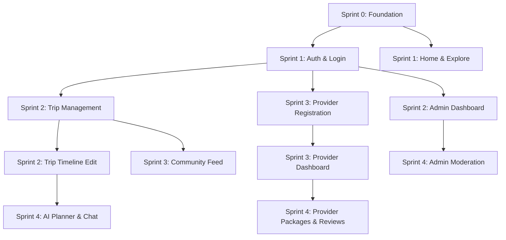

# Frontend Task Board

## 1. Executive Summary

This task board breaks down the frontend implementation into independent, assignable tasks spanning 5 Sprints (Sprint 0 to Sprint 4). Every task is sized between 1–5 Story Points and maps directly to the approved `frontend-specs`, `frontend-api-contracts`, `frontend-permissions.md`, and `playwright-checklist.md`. 

---

## 2. Sprint 0 Tasks

**EPIC 0: FOUNDATION**  
**Owner:** Auth + Admin Lead

### FE-0001 Router Setup
* **Epic**: FOUNDATION
* **Assignee**: Auth + Admin Lead
* **Priority**: P0
* **Story Points**: 2
* **Dependencies**: None
* **Required APIs**: None
* **Required Components**: `BrowserRouter`
* **Required Playwright Tests**: None
* **Definition of Done**: Routing architecture configured, lazy loading implemented, no TS errors.

### FE-0002 API Client
* **Epic**: FOUNDATION
* **Assignee**: Auth + Admin Lead
* **Priority**: P0
* **Story Points**: 3
* **Dependencies**: None
* **Required APIs**: None
* **Required Components**: Axios/Fetch instance
* **Required Playwright Tests**: None
* **Definition of Done**: Client intercepts 401s to refresh tokens, error handling global logic in place.

### FE-0003 Auth Context
* **Epic**: FOUNDATION
* **Assignee**: Auth + Admin Lead
* **Priority**: P0
* **Story Points**: 3
* **Dependencies**: FE-0002
* **Required APIs**: None
* **Required Components**: `AuthProvider`
* **Required Playwright Tests**: None
* **Definition of Done**: Global state stores JWT, decoded user roles, and handles logout dispatch.

### FE-0004 Route Guards
* **Epic**: FOUNDATION
* **Assignee**: Auth + Admin Lead
* **Priority**: P0
* **Story Points**: 2
* **Dependencies**: FE-0001, FE-0003
* **Required APIs**: None
* **Required Components**: `PublicGuard`, `AuthGuard`, `PremiumGuard`, `ProviderPendingGuard`, `ProviderGuard`, `AdminGuard`
* **Required Playwright Tests**: Public Guard, Auth Guard
* **Definition of Done**: Unauthorized users are seamlessly redirected based on roles.

### FE-0005 Main Layout
* **Epic**: FOUNDATION
* **Assignee**: Auth + Admin Lead
* **Priority**: P0
* **Story Points**: 2
* **Dependencies**: FE-0001
* **Required APIs**: None
* **Required Components**: `MainLayout`
* **Required Playwright Tests**: None
* **Definition of Done**: CSS Grid/Flexbox shell implemented containing sidebar/header slots.

### FE-0006 Sidebar
* **Epic**: FOUNDATION
* **Assignee**: Auth + Admin Lead
* **Priority**: P0
* **Story Points**: 3
* **Dependencies**: FE-0005, FE-0003
* **Required APIs**: None
* **Required Components**: `Sidebar`
* **Required Playwright Tests**: None
* **Definition of Done**: Navigation items dynamically render based on user role.

### FE-0007 Header
* **Epic**: FOUNDATION
* **Assignee**: Auth + Admin Lead
* **Priority**: P0
* **Story Points**: 2
* **Dependencies**: FE-0005, FE-0003
* **Required APIs**: None
* **Required Components**: `Header`, `ProfileDropdown`
* **Required Playwright Tests**: None
* **Definition of Done**: Header displays user avatar, navigation links, and logout action.

### FE-0008 Toast System
* **Epic**: FOUNDATION
* **Assignee**: Auth + Admin Lead
* **Priority**: P0
* **Story Points**: 2
* **Dependencies**: None
* **Required APIs**: None
* **Required Components**: `ToastProvider`
* **Required Playwright Tests**: None
* **Definition of Done**: System can dispatch success, error, warning popups globally.

### FE-0009 Error Boundary
* **Epic**: FOUNDATION
* **Assignee**: Auth + Admin Lead
* **Priority**: P1
* **Story Points**: 2
* **Dependencies**: None
* **Required APIs**: None
* **Required Components**: `ErrorBoundary`
* **Required Playwright Tests**: None
* **Definition of Done**: Unhandled React exceptions display a fallback UI instead of crashing.

### FE-0010 CI Build Verification
* **Epic**: FOUNDATION
* **Assignee**: Auth + Admin Lead
* **Priority**: P0
* **Story Points**: 2
* **Dependencies**: None
* **Required APIs**: None
* **Required Components**: None
* **Required Playwright Tests**: None
* **Definition of Done**: Pipeline configured to run TypeScript checks, ESLint, and base Playwright suite.

---

## 3. Sprint 1 Tasks

### FE-0101 Login
* **Epic**: AUTH + ADMIN
* **Assignee**: Auth + Admin Lead
* **Priority**: P0
* **Story Points**: 3
* **Dependencies**: Epic 0
* **Required APIs**: `POST /api/auth/login`
* **Required Components**: `LoginForm`
* **Required Playwright Tests**: Login, Login Error
* **Definition of Done**: User can log in, JWT saved, redirects to dashboard.

### FE-0102 Register
* **Epic**: AUTH + ADMIN
* **Assignee**: Auth + Admin Lead
* **Priority**: P0
* **Story Points**: 3
* **Dependencies**: Epic 0
* **Required APIs**: `POST /api/auth/register`
* **Required Components**: `RegisterForm`
* **Required Playwright Tests**: Registration
* **Definition of Done**: Registration form validates rules and triggers OTP.

### FE-0103 OTP Verification
* **Epic**: AUTH + ADMIN
* **Assignee**: Auth + Admin Lead
* **Priority**: P0
* **Story Points**: 2
* **Dependencies**: FE-0102
* **Required APIs**: `POST /api/auth/verify-otp`
* **Required Components**: `OTPVerificationModal`
* **Required Playwright Tests**: OTP Verification
* **Definition of Done**: Valid OTP authenticates user and logs them in.

### FE-0104 OTP Resend
* **Epic**: AUTH + ADMIN
* **Assignee**: Auth + Admin Lead
* **Priority**: P2
* **Story Points**: 1
* **Dependencies**: FE-0103
* **Required APIs**: `POST /api/auth/resend-otp`
* **Required Components**: `OTPVerificationModal`
* **Required Playwright Tests**: OTP Resend
* **Definition of Done**: 60s cooldown timer implemented, requests new OTP successfully.

### FE-0105 Forgot Password
* **Epic**: AUTH + ADMIN
* **Assignee**: Auth + Admin Lead
* **Priority**: P1
* **Story Points**: 2
* **Dependencies**: Epic 0
* **Required APIs**: `POST /api/auth/forgot-password`
* **Required Components**: `ForgotPasswordForm`
* **Required Playwright Tests**: Forgot Password
* **Definition of Done**: User can request password reset, API is called successfully.

### FE-0106 Reset Password
* **Epic**: AUTH + ADMIN
* **Assignee**: Auth + Admin Lead
* **Priority**: P1
* **Story Points**: 3
* **Dependencies**: FE-0105
* **Required APIs**: `POST /api/auth/reset-password`
* **Required Components**: `ResetPasswordForm`
* **Required Playwright Tests**: Reset Password
* **Definition of Done**: User provides OTP and new password, successfully resetting it.

### FE-0107 Home
* **Epic**: TRAVELER EXPERIENCE
* **Assignee**: Traveler Experience Lead
* **Priority**: P0
* **Story Points**: 3
* **Dependencies**: Epic 0
* **Required APIs**: `GET /api/public/home/trending-destinations`, `GET /api/public/home/trending-trips`
* **Required Components**: `TrendingDestinationsCarousel`, `PublicTripsGrid`
* **Required Playwright Tests**: Home Page Rendering
* **Definition of Done**: Carousel and Grid render API data, handling loading and error states.

### FE-0108 Explore
* **Epic**: TRAVELER EXPERIENCE
* **Assignee**: Traveler Experience Lead
* **Priority**: P0
* **Story Points**: 4
* **Dependencies**: Epic 0
* **Required APIs**: `GET /api/categories/regions`, `GET /api/categories/tags`, `GET /api/explore`
* **Required Components**: `SearchAndFilterBar`, `DiscoveryGrid`
* **Required Playwright Tests**: Explore Search & Filter
* **Definition of Done**: Search, filtering, and pagination functional.

---

## 4. Sprint 2 Tasks

### FE-0201 Trip List
* **Epic**: TRIP
* **Assignee**: Provider + Planner + AI Lead
* **Priority**: P0
* **Story Points**: 3
* **Dependencies**: FE-0101
* **Required APIs**: `GET /api/trips`, `DELETE /api/trips/{id}`
* **Required Components**: `TripsListManager`
* **Required Playwright Tests**: Trip List, Trip Deletion
* **Definition of Done**: Displays user trips, handles pagination, allows owner deletion.

### FE-0202 Trip Creation
* **Epic**: TRIP
* **Assignee**: Provider + Planner + AI Lead
* **Priority**: P0
* **Story Points**: 3
* **Dependencies**: FE-0201
* **Required APIs**: `POST /api/trips`
* **Required Components**: `TripsListManager`
* **Required Playwright Tests**: Trip Creation
* **Definition of Done**: Form validaton works, redirects to Trip Detail on success.

### FE-0203 Trip Detail
* **Epic**: TRIP
* **Assignee**: Provider + Planner + AI Lead
* **Priority**: P1
* **Story Points**: 3
* **Dependencies**: FE-0202
* **Required APIs**: `GET /api/trips/{id}`
* **Required Components**: `TripSummaryHeader`
* **Required Playwright Tests**: Trip Overview
* **Definition of Done**: Reads trip summary, displays visibility context and destinations.

### FE-0204 Trip Timeline
* **Epic**: TRIP
* **Assignee**: Provider + Planner + AI Lead
* **Priority**: P0
* **Story Points**: 4
* **Dependencies**: FE-0203
* **Required APIs**: `GET /api/trips/{id}/timeline`
* **Required Components**: `TripTimelineView`
* **Required Playwright Tests**: Permission Guard (View)
* **Definition of Done**: Read-only timeline effectively renders all daily activities.

### FE-0205 Trip Timeline Editor
* **Epic**: TRIP
* **Assignee**: Provider + Planner + AI Lead
* **Priority**: P0
* **Story Points**: 5
* **Dependencies**: FE-0204
* **Required APIs**: `PUT /api/trips/{id}/timeline`
* **Required Components**: `InteractiveTimelineManager`
* **Required Playwright Tests**: Trip Timeline Editing, Permission Guard (Edit)
* **Definition of Done**: Drag-and-drop or form-based activity ordering works, saves to backend.

### FE-0206 Collaborators
* **Epic**: TRIP
* **Assignee**: Provider + Planner + AI Lead
* **Priority**: P2
* **Story Points**: 3
* **Dependencies**: FE-0203
* **Required APIs**: `GET /api/trips/{id}/collaborators`, `POST /api/trips/{id}/collaborators`
* **Required Components**: `CollaboratorSettingsModal`
* **Required Playwright Tests**: Collaborator Management
* **Definition of Done**: Owners can add or read collaborators via modal.

### FE-0207 Destination Details
* **Epic**: TRAVELER EXPERIENCE
* **Assignee**: Traveler Experience Lead
* **Priority**: P1
* **Story Points**: 3
* **Dependencies**: FE-0108
* **Required APIs**: `GET /api/destinations/{id}`, `GET /api/destinations/{id}/services`
* **Required Components**: `DestinationHeader`, `NearbyServicesList`
* **Required Playwright Tests**: Destination Details, Service Discovery
* **Definition of Done**: Destination page dynamically loads info and lists associated services.

### FE-0208 Service Details
* **Epic**: TRAVELER EXPERIENCE
* **Assignee**: Traveler Experience Lead
* **Priority**: P1
* **Story Points**: 4
* **Dependencies**: FE-0207
* **Required APIs**: `GET /api/services/{id}`, `GET /api/services/{id}/reviews`, `POST /api/services/{id}/reviews`
* **Required Components**: `ServiceInfoPanel`, `ReviewSection`
* **Required Playwright Tests**: Service Detail, Public Review Viewing
* **Definition of Done**: Displays service details and paginates reviews.

### FE-0209 Dashboard (Traveler)
* **Epic**: TRAVELER EXPERIENCE
* **Assignee**: Traveler Experience Lead
* **Priority**: P1
* **Story Points**: 3
* **Dependencies**: FE-0101
* **Required APIs**: `GET /api/traveler/dashboard/stats`, `GET /api/trips/upcoming`
* **Required Components**: `DashboardStats`, `UpcomingScheduleWidget`
* **Required Playwright Tests**: Dashboard Load
* **Definition of Done**: Aggregates upcoming trips and stats widgets correctly.

### FE-0210 Admin Dashboard
* **Epic**: AUTH + ADMIN
* **Assignee**: Auth + Admin Lead
* **Priority**: P1
* **Story Points**: 3
* **Dependencies**: FE-0101
* **Required APIs**: `GET /api/admin/stats`, `GET /api/admin/alerts`
* **Required Components**: `SystemAnalyticsGrid`, `PendingActionAlerts`
* **Required Playwright Tests**: Admin Dashboard, Admin Guard
* **Definition of Done**: Protects route, fetches global KPIs.

### FE-0211 User Management
* **Epic**: AUTH + ADMIN
* **Assignee**: Auth + Admin Lead
* **Priority**: P1
* **Story Points**: 4
* **Dependencies**: FE-0210
* **Required APIs**: `GET /api/admin/users`, `PUT /api/admin/users/{id}/status`, `PUT /api/admin/users/{id}/role`
* **Required Components**: `UserDirectoryTable`
* **Required Playwright Tests**: User Management, User Status
* **Definition of Done**: Table supports search/pagination and inline role/status updates.

### FE-0212 Categories
* **Epic**: AUTH + ADMIN
* **Assignee**: Auth + Admin Lead
* **Priority**: P2
* **Story Points**: 3
* **Dependencies**: FE-0210
* **Required APIs**: `GET /api/admin/categories`, `POST /api/admin/categories`, `DELETE /api/admin/categories/{id}`
* **Required Components**: `MasterDataManager`
* **Required Playwright Tests**: Category Management
* **Definition of Done**: CRUD for tags/regions working without issues.

---

## 5. Sprint 3 Tasks

### FE-0301 Provider Registration
* **Epic**: PROVIDER
* **Assignee**: Provider + Planner + AI Lead
* **Priority**: P1
* **Story Points**: 3
* **Dependencies**: FE-0101
* **Required APIs**: `POST /api/provider/register`
* **Required Components**: `BusinessRegistrationForm`
* **Required Playwright Tests**: Provider Registration, Provider Guard
* **Definition of Done**: Traveler submits application safely.

### FE-0302 Document Upload
* **Epic**: PROVIDER
* **Assignee**: Provider + Planner + AI Lead
* **Priority**: P1
* **Story Points**: 3
* **Dependencies**: FE-0301
* **Required APIs**: `POST /api/provider/upload-docs`
* **Required Components**: `BusinessRegistrationForm`
* **Required Playwright Tests**: Provider Registration
* **Definition of Done**: Multipart upload for license/id works correctly.

### FE-0303 Pending Status
* **Epic**: PROVIDER
* **Assignee**: Provider + Planner + AI Lead
* **Priority**: P2
* **Story Points**: 2
* **Dependencies**: FE-0301
* **Required APIs**: `GET /api/provider/status`
* **Required Components**: `PendingStatusView`
* **Required Playwright Tests**: Pending Status
* **Definition of Done**: Users waiting for approval see the correct read-only screen.

### FE-0304 Provider Dashboard
* **Epic**: PROVIDER
* **Assignee**: Provider + Planner + AI Lead
* **Priority**: P1
* **Story Points**: 3
* **Dependencies**: FE-0301
* **Required APIs**: `GET /api/provider/stats`
* **Required Components**: `ProviderKPIWidget`
* **Required Playwright Tests**: Provider Dashboard
* **Definition of Done**: Shows revenue and rating metrics.

### FE-0305 Provider Services List
* **Epic**: PROVIDER
* **Assignee**: Provider + Planner + AI Lead
* **Priority**: P1
* **Story Points**: 3
* **Dependencies**: FE-0304
* **Required APIs**: `GET /api/provider/services`
* **Required Components**: `ServicesDataTable`
* **Required Playwright Tests**: Service Editing (Listing part)
* **Definition of Done**: Displays provider's owned services in a table.

### FE-0306 Create Service
* **Epic**: PROVIDER
* **Assignee**: Provider + Planner + AI Lead
* **Priority**: P1
* **Story Points**: 3
* **Dependencies**: FE-0305
* **Required APIs**: `POST /api/provider/services`
* **Required Components**: `ServiceEditorForm`
* **Required Playwright Tests**: Service Creation
* **Definition of Done**: Editor successfully creates a service.

### FE-0307 Edit Service
* **Epic**: PROVIDER
* **Assignee**: Provider + Planner + AI Lead
* **Priority**: P1
* **Story Points**: 3
* **Dependencies**: FE-0306
* **Required APIs**: `PUT /api/provider/services/{id}`
* **Required Components**: `ServiceEditorForm`
* **Required Playwright Tests**: Service Editing
* **Definition of Done**: Pre-fills editor and updates existing service.

### FE-0308 Community Feed
* **Epic**: TRAVELER EXPERIENCE
* **Assignee**: Traveler Experience Lead
* **Priority**: P1
* **Story Points**: 5
* **Dependencies**: FE-0101
* **Required APIs**: `GET /api/community/feed`, `GET /api/community/top-bloggers`
* **Required Components**: `CommunityFeedFilter`, `SocialTripCard`, `TopBloggersSidebar`
* **Required Playwright Tests**: Community Feed
* **Definition of Done**: Infinite scrolling/pagination works on social feed.

### FE-0309 Blogs
* **Epic**: TRAVELER EXPERIENCE
* **Assignee**: Traveler Experience Lead
* **Priority**: P1
* **Story Points**: 5
* **Dependencies**: None
* **Required APIs**: `GET /api/blogs`, `POST /api/blogs`, `GET /api/blogs/{id}`
* **Required Components**: `BlogFeedGrid`, `BlogContentReader`, `RichTextBlogEditor`
* **Required Playwright Tests**: Blog Feed, Blog Detail, Blog Creation
* **Definition of Done**: Users can browse, read, and author Rich Text blogs.

### FE-0310 Comments
* **Epic**: TRAVELER EXPERIENCE
* **Assignee**: Traveler Experience Lead
* **Priority**: P2
* **Story Points**: 3
* **Dependencies**: FE-0309
* **Required APIs**: `GET /api/blogs/{id}/comments`, `POST /api/blogs/{id}/comments`
* **Required Components**: `CommentSection`
* **Required Playwright Tests**: Blog Comments
* **Definition of Done**: Comments load under blogs, travelers can post replies.

### FE-0311 Profile
* **Epic**: AUTH + ADMIN
* **Assignee**: Auth + Admin Lead
* **Priority**: P2
* **Story Points**: 3
* **Dependencies**: FE-0101
* **Required APIs**: `GET /api/profile`, `PUT /api/profile`
* **Required Components**: `ProfileHeader`, `PersonalInfoForm`
* **Required Playwright Tests**: Profile Update
* **Definition of Done**: User details load correctly and form updates save properly.

### FE-0312 Change Password
* **Epic**: AUTH + ADMIN
* **Assignee**: Auth + Admin Lead
* **Priority**: P2
* **Story Points**: 2
* **Dependencies**: FE-0311
* **Required APIs**: `PUT /api/profile/password`
* **Required Components**: `PasswordChangeForm`
* **Required Playwright Tests**: Password Update
* **Definition of Done**: Input checks current/new password effectively.

### FE-0313 Avatar Upload
* **Epic**: AUTH + ADMIN
* **Assignee**: Auth + Admin Lead
* **Priority**: P2
* **Story Points**: 2
* **Dependencies**: FE-0311
* **Required APIs**: `POST /api/profile/avatar`
* **Required Components**: `ProfileHeader`
* **Required Playwright Tests**: Avatar Upload
* **Definition of Done**: File is uploaded and component state updates with new image URL.

### FE-0314 Notifications
* **Epic**: AUTH + ADMIN
* **Assignee**: Auth + Admin Lead
* **Priority**: P2
* **Story Points**: 3
* **Dependencies**: FE-0101
* **Required APIs**: `GET /api/notifications`, `PUT /api/notifications/{id}/read`
* **Required Components**: `NotificationList`
* **Required Playwright Tests**: Notifications
* **Definition of Done**: Fetch unread feed, mark as read on click.

---

## 6. Sprint 4 Tasks

### FE-0401 Follow User
* **Epic**: TRAVELER EXPERIENCE
* **Assignee**: Traveler Experience Lead
* **Priority**: P2
* **Story Points**: 2
* **Dependencies**: FE-0308
* **Required APIs**: `POST /api/users/{id}/follow`
* **Required Components**: `TopBloggersSidebar`
* **Required Playwright Tests**: User Follow
* **Definition of Done**: Optimistic UI update on follow button click.

### FE-0402 Like Trip
* **Epic**: TRAVELER EXPERIENCE
* **Assignee**: Traveler Experience Lead
* **Priority**: P1
* **Story Points**: 2
* **Dependencies**: FE-0308
* **Required APIs**: `POST /api/trips/{id}/like`
* **Required Components**: `SocialTripCard`
* **Required Playwright Tests**: Trip Liking
* **Definition of Done**: Increment like count and toggle active state successfully.

### FE-0403 Clone Trip
* **Epic**: TRAVELER EXPERIENCE
* **Assignee**: Traveler Experience Lead
* **Priority**: P1
* **Story Points**: 3
* **Dependencies**: FE-0308, FE-0202
* **Required APIs**: `POST /api/trips/{id}/clone`
* **Required Components**: `SocialTripCard`
* **Required Playwright Tests**: Trip Cloning
* **Definition of Done**: Modal to select new dates, clones safely and redirects to editor.

### FE-0404 Reviews
* **Epic**: PROVIDER
* **Assignee**: Provider + Planner + AI Lead
* **Priority**: P2
* **Story Points**: 3
* **Dependencies**: FE-0304
* **Required APIs**: `GET /api/provider/reviews`
* **Required Components**: `ReviewInbox`
* **Required Playwright Tests**: Review Management
* **Definition of Done**: Shows incoming reviews for all provider's services.

### FE-0405 Reply Review
* **Epic**: PROVIDER
* **Assignee**: Provider + Planner + AI Lead
* **Priority**: P2
* **Story Points**: 2
* **Dependencies**: FE-0404
* **Required APIs**: `POST /api/provider/reviews/{id}/reply`
* **Required Components**: `ReviewInbox`
* **Required Playwright Tests**: Review Management
* **Definition of Done**: Text box submits response and links it to the review.

### FE-0406 Packages
* **Epic**: PROVIDER
* **Assignee**: Provider + Planner + AI Lead
* **Priority**: P2
* **Story Points**: 2
* **Dependencies**: FE-0304
* **Required APIs**: `GET /api/packages/provider`
* **Required Components**: `PackagePricingTable`
* **Required Playwright Tests**: Package Subscription
* **Definition of Done**: Dynamic table renders tier info from API.

### FE-0407 Subscribe Package
* **Epic**: PROVIDER
* **Assignee**: Provider + Planner + AI Lead
* **Priority**: P2
* **Story Points**: 3
* **Dependencies**: FE-0406
* **Required APIs**: `POST /api/provider/packages/subscribe-simulated`
* **Required Components**: `SimulatedCheckoutForm`
* **Required Playwright Tests**: Package Subscription
* **Definition of Done**: Stripe/Simulated checkout finishes and updates provider stats.

### FE-0408 Moderation
* **Epic**: AUTH + ADMIN
* **Assignee**: Auth + Admin Lead
* **Priority**: P2
* **Story Points**: 4
* **Dependencies**: FE-0210
* **Required APIs**: `GET /api/admin/moderation`, `POST /api/admin/moderation/{id}/resolve`
* **Required Components**: `ModerationWorkspace`
* **Required Playwright Tests**: Content Moderation
* **Definition of Done**: List reported items, process Approve/Dismiss actions.

### FE-0409 Upgrade Flow
* **Epic**: AI
* **Assignee**: Provider + Planner + AI Lead
* **Priority**: P1
* **Story Points**: 3
* **Dependencies**: FE-0101
* **Required APIs**: None (Internal flow / Stripe simulation)
* **Required Components**: `PremiumGuard`
* **Required Playwright Tests**: Upgrade Flow, Premium Guard
* **Definition of Done**: Standard user sees upgrade gate and can simulate payment to upgrade role.

### FE-0410 AI Generate Trip
* **Epic**: AI
* **Assignee**: Provider + Planner + AI Lead
* **Priority**: P1
* **Story Points**: 5
* **Dependencies**: FE-0409
* **Required APIs**: `POST /api/ai/generate`
* **Required Components**: `AIPromptWizard`, `AIGenerationResults`
* **Required Playwright Tests**: AI Trip Generation
* **Definition of Done**: Handles complex prompt wizard state, loading spinners, and outputs timeline.

### FE-0411 AI Chat
* **Epic**: AI
* **Assignee**: Provider + Planner + AI Lead
* **Priority**: P1
* **Story Points**: 4
* **Dependencies**: FE-0409
* **Required APIs**: `POST /api/ai/chat`
* **Required Components**: `ChatConversationBox`
* **Required Playwright Tests**: AI Chatbot
* **Definition of Done**: Persistent chat drawer works, maintaining context window history.

### FE-0412 AI Route Optimization
* **Epic**: AI
* **Assignee**: Provider + Planner + AI Lead
* **Priority**: P1
* **Story Points**: 4
* **Dependencies**: FE-0205, FE-0409
* **Required APIs**: `POST /api/ai/optimize-route`
* **Required Components**: `AIRouteOptimizerWidget`
* **Required Playwright Tests**: AI Route Optimization
* **Definition of Done**: Plugs into interactive timeline, re-orders destinations based on AI response.

### FE-0413 AI Budget Advisor
* **Epic**: AI
* **Assignee**: Provider + Planner + AI Lead
* **Priority**: P2
* **Story Points**: 3
* **Dependencies**: FE-0205, FE-0409
* **Required APIs**: `POST /api/ai/analyze-budget`
* **Required Components**: `AIBudgetAdvisorWidget`
* **Required Playwright Tests**: AI Budget Advisor
* **Definition of Done**: Dynamic widget calculates totals and flags over-budget items via AI feedback.

---

## 7. Dependency Graph

---

## 8. Critical Path

1. **Foundation (FE-0001 to FE-0004)** -> Required for everything.
2. **Authentication (FE-0101)** -> Required for user dashboards, trips, and admin.
3. **Trip Creation & Timeline (FE-0201 to FE-0205)** -> Required to unlock AI Route Optimization and Budget features.
4. **AI Generation & Optimization (FE-0410, FE-0412)** -> Core value proposition for premium users.

---

## 9. Team Workload Summary

* **Auth + Admin Lead**: 
  * Sprint 0: ~21 SP (Foundation Setup)
  * Sprint 1: ~14 SP (Auth Flows)
  * Sprint 2: ~10 SP (Admin Base)
  * Sprint 3: ~10 SP (Profile/Notifications)
  * Sprint 4: ~4 SP (Moderation & Polish)
  * **Total**: ~59 Story Points

* **Traveler Experience Lead**: 
  * Sprint 0: ~0 SP
  * Sprint 1: ~7 SP (Home/Explore)
  * Sprint 2: ~10 SP (Destination/Service/Dashboard)
  * Sprint 3: ~18 SP (Community & Blogs)
  * Sprint 4: ~7 SP (Social actions)
  * **Total**: ~42 Story Points

* **Provider + Planner + AI Lead**:
  * Sprint 0: ~0 SP
  * Sprint 1: ~0 SP
  * Sprint 2: ~18 SP (Trips Core)
  * Sprint 3: ~17 SP (Provider Base)
  * Sprint 4: ~26 SP (AI & Provider Ops)
  * **Total**: ~61 Story Points

*(Note: While workloads are back-loaded for the Traveler and AI leads, they will assist the Auth Lead with Epic 0 Tasks in Sprint 0 to balance velocity).*
