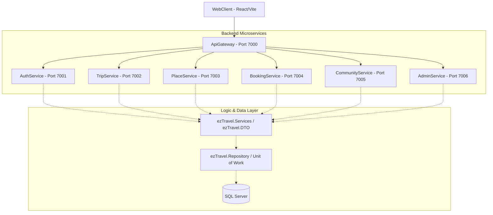

# Bản Đồ Dự Án: ezTravel

## 1. Tổng Quan Kiến Trúc
ezTravel được xây dựng trên **Kiến trúc Microservices** với sự tách biệt rõ ràng giữa frontend, các dịch vụ backend và lớp truy cập dữ liệu. Toàn bộ hệ thống được điều phối qua **API Gateway (YARP)**.

### Sơ Đồ Hệ Thống

## 2. Cấu Trúc Frontend (WebClient)
Tuân thủ tiêu chuẩn `AI_RULES.md`:

- `src/api`: Lớp API tập trung (Axios instance, Interceptors).
- `src/store`: Quản lý trạng thái toàn cục (Zustand).
- `src/layouts`: Các bố cục ứng dụng (MainLayout, UserLayout).
- `src/routes`: Cấu hình định tuyến tập trung và bảo mật (Guards).
- `src/pages`: 
  - `admin_pages`: Quản lý người dùng, Dashboard, Kiểm duyệt.
  - `user_pages`: Home, Tours, Hotels, Blogs, About, Contact.
- `src/components`: Các thành phần dùng chung (ProtectedRoute, PublicRoute).
- `src/hooks`, `src/utils`, `src/constants`, `src/lib`, `src/types`: Các tiện ích mô-đun hóa.

## 3. Cấu Trúc Backend (Microservices & Services)

### Các Dịch Vụ Backend (Ports: 7001-7006)
- **ezTravel.AuthService (7001):** Xác thực, JWT, Đăng ký/Đăng nhập.
- **ezTravel.TripService (7002):** Lập kế hoạch, quản lý Timeline, Reorder, Tính chi phí.
- **ezTravel.PlaceService (7003):** Tìm kiếm địa điểm, Nearby Search, Thông tin chi tiết.
- **ezTravel.BookingService (7004):** Đặt dịch vụ, Giỏ hàng, Thanh toán (Mock).
- **ezTravel.CommunityService (7005):** Đánh giá (Reviews), Chia sẻ lịch trình (Feeds).
- **ezTravel.AdminService (7006):** Quản trị người dùng, Thống kê hệ thống.

### Lớp Nghiệp Vụ & Dữ Liệu
- `Services/ezTravel.Services`: Triển khai logic nghiệp vụ (Auth, Trips, Places, Bookings, v.v.).
- `Services/ezTravel.DTO`: Định nghĩa các đối tượng trao đổi dữ liệu.
- `DataAccess/ezTravel.Entities`: Thực thể cơ sở dữ liệu.
- `DataAccess/ezTravel.Libs`: Database Context (`AppDbContext.cs`).
- `DataAccess/ezTravel.Repository`: Repository Pattern & Unit of Work.

## 4. Luồng Dữ Liệu
`UI (React) -> Store (Zustand) -> API Client (Axios) -> ApiGateway (7000) -> Microservice Controller -> Service -> Repository -> Database`

## 5. Tài Khoản Kiểm Thử (Test Accounts)

| Vai trò | Email | Mật khẩu | Ghi chú |
| :--- | :--- | :--- | :--- |
| **Admin** | `admin@eztravel.com` | `Admin@123` | Truy cập Dashboard Admin (Port 7006) |
| **Traveler** | `traveler@gmail.com` | `Password@123` | Người dùng lập kế hoạch & đặt dịch vụ |
| **ServiceProvider** | `partner@muongthanh.com` | `Partner@123` | Nhà cung cấp (Tương lai) |
| **Guest** | `guest@test.com` | `Guest@123` | Chỉ xem thông tin công khai |

---
*Cập nhật lần cuối: 06/05/2026 - Đồng bộ cổng 7000 và hoàn thiện logic services*
