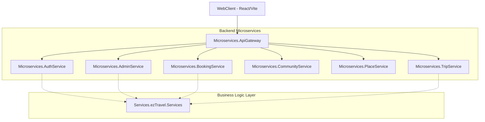

# Bản Đồ Dự Án: ezTravel

## 1. Tổng Quan Kiến Trúc
ezTravel được xây dựng trên **Kiến trúc Microservices** với sự tách biệt rõ ràng giữa frontend, các dịch vụ backend và lớp truy cập dữ liệu.

### Sơ Đồ Hệ Thống

## 2. Cấu Trúc Frontend (WebClient)
Tuân thủ tiêu chuẩn `AI_RULES.md`:

- `src/api`: Lớp API tập trung (Axios instance, Interceptors).
- `src/store`: Quản lý trạng thái toàn cục (Zustand).
- `src/layouts`: Các bố cục ứng dụng (MainLayout, UserLayout).
- `src/routes`: Cấu hình định tuyến tập trung và bảo mật (Guards).
- `src/pages`: 
  - `admin_pages`: Login, Dashboard, Products, Users, Categories.
  - `user_pages`: Home, Tours, Hotels, Blogs, About, Contact.
- `src/components`: Các thành phần dùng chung (ProtectedRoute, PublicRoute).
- `src/hooks`, `src/utils`, `src/constants`, `src/lib`, `src/types`: Các tiện ích mô-đun hóa.

## 3. Cấu Trúc Backend (Microservices & Services)

### Các Dịch Vụ Backend
- `ezTravel.AuthService`: Xác thực, JWT và Định danh.
- `ezTravel.AdminService`: Quản lý hệ thống và báo cáo.
- `ezTravel.BookingService`: Xử lý đặt chỗ và thanh toán.
- `ezTravel.PlaceService`: Quản lý điểm đến và dịch vụ.
- `ezTravel.TripService`: Lập kế hoạch và chia sẻ lộ trình.

### Lớp Nghiệp Vụ & Dữ Liệu
- `Services/ezTravel.Services`: Triển khai logic nghiệp vụ cốt lõi.
- `Services/ezTravel.DTO`: Các đối tượng chuyển đổi dữ liệu cho API.
- `DataAccess/ezTravel.Entities`: Các mô hình thực thể cơ sở dữ liệu dùng chung.
- `DataAccess/ezTravel.Libs`: Context cơ sở dữ liệu (`AppDbContext.cs`).
- `DataAccess/ezTravel.Repository`: Triển khai mô hình Repository & Unit of Work.

## 4. Luồng Dữ Liệu
`UI (React) -> Store (Zustand) -> API Client (Axios) -> Backend Controller -> Service -> Repository -> Database (SQL Server)`

## 5. Tài Khoản Kiểm Thử (Test Accounts)
Dùng để kiểm tra phân quyền hệ thống:

| Vai trò | Email | Mật khẩu | Ghi chú |
| :--- | :--- | :--- | :--- |
| **Admin** | `admin@eztravel.com` | `Admin@123` | Toàn quyền, truy cập Dashboard |
| **Traveler** | `traveler@gmail.com` | `Password@123` | Người dùng mặc định |
| **ServiceProvider** | `partner@muongthanh.com` | `Partner@123` | Nhà cung cấp dịch vụ (guide) |
| **Guest** | `guest@test.com` | `Guest@123` | Khách vãng lai |

---
*Cập nhật lần cuối: 06/05/2026*
